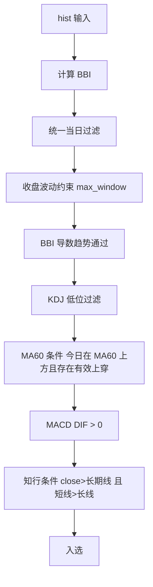
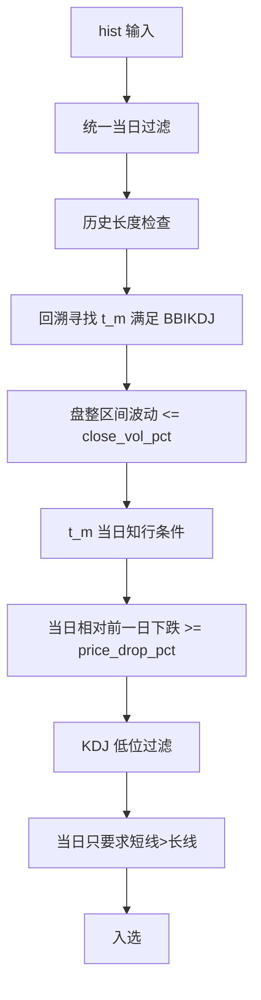
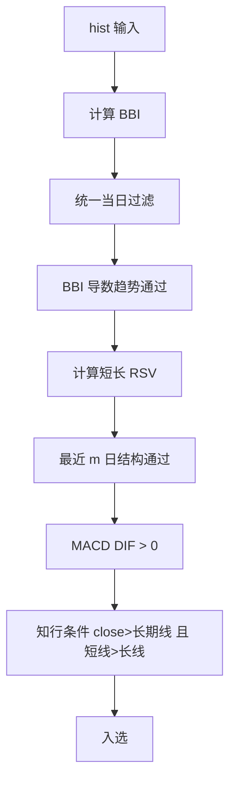
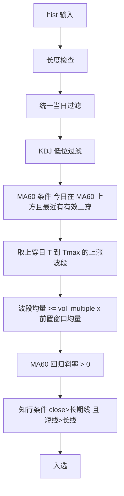
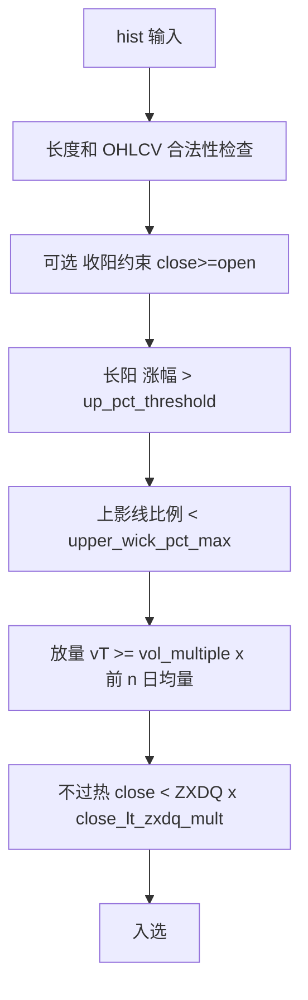
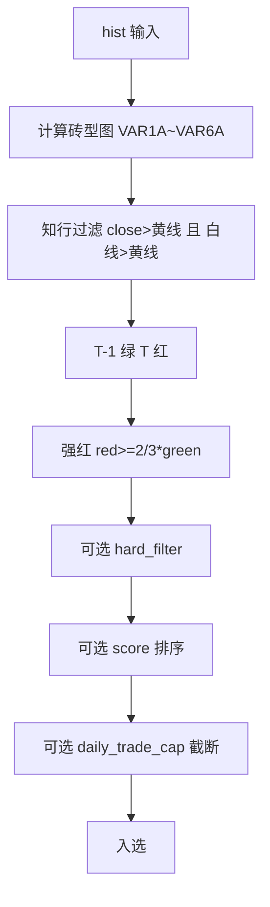

# Z哥战法的 Python 实现（更新版）

> **更新时间：2026-03-04** –
>
> 新增 **ZXBrickTurnSelector v3**：支持 `hard_filter + score_model + daily_trade_cap`，并提供过滤/执行审计与权重网格搜索脚本。

---

## 目录

* [项目简介](#项目简介)
* [快速上手](#快速上手)

  * [环境与依赖](#环境与依赖)
  * [准备 .env（Tushare Token）](#准备-envtushare-token)
  * [准备 stocklist.csv](#准备-stocklistcsv)
  * [下载历史 K 线（qfq，日线）](#下载历史-k-线qfq日线)
  * [运行选股](#运行选股)
  * [运行回测](#运行回测)
  * [ZXBrick v3 权重网格搜索](#zxbrick-v3-权重网格搜索)
* [参数说明](#参数说明)

  * [`fetch_kline.py`](#fetch_klinepy)
  * [`select_stock.py`](#select_stockpy)
  * [`backtest_selectors.py`](#backtest_selectorspy)
* [统一当日过滤 & 知行约束](#统一当日过滤--知行约束)
* [内置策略（Selector）](#内置策略selector)

  * [1. BBIKDJSelector（少妇战法）](#1-bbikdjselector少妇战法)
  * [2. SuperB1Selector（SuperB1战法）](#2-superb1selectorsuperb1战法)
  * [3. BBIShortLongSelector（补票战法）](#3-bbishortlongselector补票战法)
  * [4. PeakKDJSelector（填坑战法）](#4-peakkdjselector填坑战法)
  * [5. MA60CrossVolumeWaveSelector（上穿60放量战法）](#5-ma60crossvolumewaveselector上穿60放量战法)
  * [6. BigBullishVolumeSelector（暴力K战法）](#6-bigbullishvolumeselector暴力k战法)
  * [7. ZXBrickTurnSelector（搬砖战法）](#7-zxbrickturnselector搬砖战法)

* [策略流程图（Mermaid）](#策略流程图mermaid)
* [实盘执行手册](#实盘执行手册)
* [每日操作清单（一页版）](#每日操作清单一页版)
* [项目结构](#项目结构)
* [常见问题](#常见问题)
* [免责声明](#免责声明)

---

## 项目简介

| 名称                    | 功能简介                                                                                                                                                                               |
| --------------------- | ---------------------------------------------------------------------------------------------------------------------------------------------------------------------------------- |
| **`scripts/fetch_kline.py`**  | 仅使用 **Tushare** 抓取 **A 股日线（前复权 qfq）**。股票池从 `configs/stocklist.csv` 读取，支持排除 **创业板/科创板/北交所**，并发抓取，默认按股票 **增量更新**（仅补新日期，保留历史），输出 CSV 列：`date, open, close, high, low, volume`。 |
| **`scripts/select_stock.py`** | 加载 `./data` 目录内 CSV 行情与配置，批量执行选择器（Selector），支持 `--audit` 输出硬过滤失败与执行淘汰（daily cap）审计文件。 |
| **`scripts/backtest_selectors.py`** | 按交易日逐日回放 selector 选股，支持固定/自适应离场；若 selector 支持 `select_with_audit`，回测与选股端使用同一最终入选口径。 |
| **`scripts/fetch_aux_data.py`** | 批量抓取 `daily_basic/moneyflow/sw_daily` 等辅助数据至 `data_aux`，供 ZXBrick 增强过滤与评分使用。 |
| **`scripts/grid_search_zxbrick_v3.py`** | 对 ZXBrick v3 执行权重网格搜索，并输出 `hard_filter` 与 `DAILY_CAP` 高频失败原因榜。 |
| **`core/selector.py`**     | 实现各类战法（选择器）。**已删除 TePu 战法**；现包含 7 个策略。多数策略包含“当日过滤 & 知行约束”，搬砖战法支持按参数启停。                                                                                                                           |

---

## 快速上手

### 环境与依赖

```bash
# 进入你的项目目录
cd /path/to/your/project

# Python 3.11/3.12 均可，示例以系统 python3
python3 -m venv .venv

# macOS / Linux 激活
source .venv/bin/activate

# Windows (PowerShell) 激活
# .venv\Scripts\Activate.ps1

# 升级 pip（可选）
python -m pip install --upgrade pip

# 安装依赖
python -m pip install -r requirements.txt
```

> 关键依赖：`pandas`, `tqdm`, `tushare`, `numpy`, `scipy`。

### 准备 .env（Tushare Token）

1. 在项目根目录创建 `.env` 文件并写入：

```bash
# 可选：先复制模板
cp .env.example .env

# 编辑 .env，填入你的 token
TUSHARE_TOKEN=你的token
```

> `scripts/fetch_kline.py` 默认会读取 `./.env`。如需使用其它路径，可传 `--env-file /path/to/.env`。

### 下载历史 K 线（qfq，日线）

```bash
python scripts/fetch_kline.py \
  --start 20240101 \
  --end today \
  --stocklist ./configs/stocklist.csv \
  --exclude-boards gem star bj \
  --out ./data \
  --workers 6 \
  --max-requests-per-minute 50
```

* **数据源固定**：Tushare 日线，**前复权 qfq**。
* **保存策略**：每只股票按 **增量更新** 写入 `./data/XXXXXX.csv`（仅补新交易日，保留历史数据）。
* **并发 + 限频**：默认 6 线程，且全局默认限制为 **50 次/分钟**；支持封禁冷却（命中「访问频繁/429/403…」将睡眠约 600s 并重试，最多 3 次）。

### 运行选股

```bash
python scripts/select_stock.py \
  --data-dir ./data \
  --config ./configs/backtest_brick_compare_aux_top2.json \
  --date 2026-03-03 \
  --audit failed_only \
  --out-dir ./out
```

> `--date` 可省略，默认取数据中的最后交易日。
>
> 每次运行会在 `--out-dir` 下生成结果与审计文件：
> `select_results_*.json`、`select_results_summary_*.csv`、`select_results_detail_*.csv`、`select_filter_audit_*.csv/json`、`select_execution_audit_*.csv/json`。

### ZXBrick v3 权重网格搜索

```bash
python scripts/grid_search_zxbrick_v3.py \
  --data-dir ./data \
  --config ./configs/backtest_brick_compare_aux_top2.json \
  --selector-alias 搬砖_增强v3_top2 \
  --start-date 2025-01-01 \
  --end-date 2026-03-03 \
  --entry-price open \
  --hold-days 2 \
  --daily-trade-cap 2 \
  --grid-values 0.1,0.15,0.2,0.25,0.3,0.35,0.4 \
  --top-k 30 \
  --audit-top-n 30 \
  --out-dir ./out
```

> 产出包括：`grid_search_zxbrick_v3_*_summary.csv`、`*_top30.csv`、`*_best.json`、以及 hard filter / cap reject 榜单 CSV。

## 实盘执行手册

- 见文档：`docs/zxbrick-v3-ops-playbook.md`

## 每日操作清单（一页版）

- 见文档：`docs/zxbrick-v3-daily-checklist.md`

### 运行回测

```bash
python scripts/backtest_selectors.py \
  --data-dir ./data \
  --config ./configs/configs.json \
  --start-date 2025-01-01 \
  --end-date 2026-03-02 \
  --selector 少妇战法 \
  --exit-mode adaptive \
  --max-hold-days 60 \
  --stop-buffer-pct 0.001 \
  --n-structure-lookback 60 \
  --big-bull-body-pct 0.03 \
  --entry-price open \
  --benchmark-code 000001 \
  --out-dir ./out
```

说明：

* 回测会按交易日逐日调用对应 `Selector` 选股；
* 每个信号在下一根 K 线入场（`--entry-price open|close`）；
* `fixed` 模式：持有 `--hold-days` 根后离场（旧逻辑）；
* `adaptive` 模式（止盈止损）：
  * 止损：以“入场 K 线 low 与 N 型上一个低点”的更低者下浮 `--stop-buffer-pct` 作为止损价；
  * 止盈放飞：`BBI` 上方连续两根中大阳线（实体涨幅 ≥ `--big-bull-body-pct`）减半仓，后续重复；
  * 离场：连续两日收盘跌破 `BBI` 全部离场；
  * 保险阀：持有超过 `--max-hold-days` 收盘离场；
* 同时持有的仓位按“当日等权”合成策略日收益；
* 输出 `summary.csv + 每策略 daily.csv + 每策略 trades.csv + json`。

---

## 参数说明

### `fetch_kline.py`

实际实现位于 `scripts/fetch_kline.py`。

| 参数                 | 默认值               | 说明                                                                         |
| ------------------ | ----------------- | -------------------------------------------------------------------------- |
| `--start`          | `20190101`        | 起始日期，格式 `YYYYMMDD` 或 `today`                                               |
| `--end`            | `today`           | 结束日期，格式同上                                                                  |
| `--stocklist`      | `./configs/stocklist.csv` | 股票清单 CSV 路径（含 `ts_code` 或 `symbol`）                                        |
| `--exclude-boards` | `[]`              | 排除板块，枚举：`gem`(创业板 300/301) / `star`(科创板 688) / `bj`(北交所 .BJ / 4/8 开头)。可多选。 |
| `--env-file`       | `./.env`          | `.env` 文件路径（读取 `TUSHARE_TOKEN`）                                              |
| `--out`            | `./data`          | 输出目录（自动创建）                                                                 |
| `--workers`        | `6`               | 并发线程数                                                                      |
| `--max-requests-per-minute` | `50`      | 全局分钟级限频（所有线程合计请求次数上限）                                                   |

**输出 CSV 列**：`date, open, close, high, low, volume`（按日期升序）。

**增量更新逻辑**：若 `./data/XXXXXX.csv` 已存在，则仅请求 `max(--start, 本地最后日期+1天)` 到 `--end` 的区间，并与本地数据按日期去重合并。

**抓取与重试**：每支股票最多 3 次尝试；疑似限流/封禁触发 **600s 冷却**；其它异常采用递进式短等候重试（15s×尝试次数）。

### `select_stock.py`

实际实现位于 `scripts/select_stock.py`。

| 参数           | 默认值              | 说明       |
| ------------ | ---------------- | -------- |
| `--data-dir` | `./data`         | CSV 行情目录 |
| `--config`   | `./configs/configs.json` | 选择器配置    |
| `--date`     | 数据最后交易日          | 选股交易日    |
| `--audit`    | `failed_only`    | 审计级别：`off/failed_only/full` |
| `--out-dir`  | `./out`          | 结果落盘目录（JSON + CSV） |

### `backtest_selectors.py`

实际实现位于 `scripts/backtest_selectors.py`。

| 参数 | 默认值 | 说明 |
| --- | --- | --- |
| `--data-dir` | `./data` | CSV 行情目录 |
| `--config` | `./configs/configs.json` | Selector 配置文件 |
| `--start-date` | 必填 | 回测起始日期 `YYYY-MM-DD` |
| `--end-date` | 必填 | 回测结束日期 `YYYY-MM-DD` |
| `--tickers` | `all` | `all` 或逗号分隔代码 |
| `--selector` | `all` | `all` 或逗号分隔策略 `alias/class` |
| `--entry-price` | `open` | 入场价：`open` 或 `close` |
| `--exit-mode` | `fixed` | 离场模式：`fixed` 或 `adaptive` |
| `--hold-days` | `5` | `fixed` 模式每笔持有 K 线根数 |
| `--max-hold-days` | `60` | `adaptive` 模式最大持有根数（保险阀） |
| `--stop-buffer-pct` | `0.001` | 止损线下浮比例（0.1%） |
| `--n-structure-lookback` | `60` | N 型上一个低点回看窗口 |
| `--big-bull-body-pct` | `0.03` | 中大阳线实体阈值（3%） |
| `--min-position-ratio-for-halve` | `0.02` | 剩余仓位市值低于该比例时不再继续减半 |
| `--benchmark-code` | 空 | 可选基准代码（需在 `data` 目录中存在） |
| `--out-dir` | `./out` | 输出目录 |

---

## 统一当日过滤 & 知行约束

`core/selector.py` 中有两类通用过滤：

1. `passes_day_constraints_today(df, pct_limit=0.02, amp_limit=0.07)`  
   默认要求：
   - 当日相对前一日涨跌幅绝对值 `< 2%`；
   - 当日振幅 `(high-low)/low < 7%`。

2. `zx_condition_at_positions(...)`  
   对应“知行趋势线”条件：
   - `close > ZXDKX`（可配置）
   - `ZXDQ > ZXDKX`（可配置）

当前代码口径：

- 前 6 个策略（`BBIKDJ / SuperB1 / BBIShortLong / PeakKDJ / MA60CrossVolumeWave / BigBullishVolume`）默认都会走“当日过滤 + 知行约束”；
- `ZXBrickTurnSelector（搬砖战法）` 默认核心信号为：`close>黄线 && 白线>黄线`、`T-1绿/T红`、`红砖强度达标`；
- 开启增强参数后可叠加：
  - `hard_filter`（涨幅区间、收盘接近日高、实体占比、量比、3日资金、行业强度）；
  - `score_model`（砖强度/量比/资金/行业加权）；
  - `daily_trade_cap`（每策略每日最多 N 笔，默认在增强配置中常用 `2`）。

---

## 内置策略（Selector）

> **提示**：文中“窗口”均指交易日数量。实际实现均已替换为最新代码逻辑。

### 1. BBIKDJSelector（少妇战法）

核心逻辑：

* **价格波动约束**：最近 `max_window` 根收盘价的波动（`high/low-1`）≤ `price_range_pct`；
* **BBI 上升**：`bbi_deriv_uptrend`，允许一阶差分在 `bbi_q_threshold` 分位内为负（容忍回撤）；
* **KDJ 低位**：当日 J 值 **< `j_threshold`** 或 **≤ 最近 `max_window` 的 `j_q_threshold` 分位**；
* **MACD**：`DIF > 0`；
* **MA60 条件**：当日 `close ≥ MA60` 且最近 `max_window` 内存在“**有效上穿 MA60**”；
* **知行当日约束**：**收盘 > 长期线** 且 **短期线 > 长期线**。

`configs/configs.json` 预设（与示例一致）：

```json
{
  "class": "BBIKDJSelector",
  "alias": "少妇战法",
  "activate": true,
  "params": {
    "j_threshold": 15,
    "bbi_min_window": 20,
    "max_window": 120,
    "price_range_pct": 1,
    "bbi_q_threshold": 0.2,
    "j_q_threshold": 0.10
  }
}
```

### 2. SuperB1Selector（SuperB1战法）

核心逻辑：

1. 在 `lookback_n` 窗内，存在某日 `t_m` **满足 BBIKDJSelector**；
2. 区间 `[t_m, 当日前一日]` 收盘价波动率 ≤ `close_vol_pct`；
3. 当日相对前一日 **下跌 ≥ `price_drop_pct`**；
4. 当日 J **< `j_threshold`** 或 **≤ `j_q_threshold` 分位**；
5. **知行约束**：

   * 在 `t_m` 当日：**收盘 > 长期线** 且 **短期线 > 长期线**；
   * 在 **当日**：只需 **短期线 > 长期线**。

`configs/configs.json` 预设：

```json
{
  "class": "SuperB1Selector",
  "alias": "SuperB1战法",
  "activate": true,
  "params": {
    "lookback_n": 10,
    "close_vol_pct": 0.02,
    "price_drop_pct": 0.02,
    "j_threshold": 10,
    "j_q_threshold": 0.10,
    "B1_params": {
      "j_threshold": 15,
      "bbi_min_window": 20,
      "max_window": 120,
      "price_range_pct": 1,
      "bbi_q_threshold": 0.3,
      "j_q_threshold": 0.10
    }
  }
}
```

### 3. BBIShortLongSelector（补票战法）

核心逻辑：

* **BBI 上升**（容忍回撤）；
* 最近 `m` 日内：

  * 长 RSV（`n_long`）**全 ≥ `upper_rsv_threshold`**；
  * 短 RSV（`n_short`）出现“**先 ≥ upper，再 < lower**”的序列结构；
  * 当日短 RSV **≥ upper**；
* **MACD**：`DIF > 0`；
* **知行当日约束**：**收盘 > 长期线** 且 **短期线 > 长期线**。

`configs/configs.json` 预设：

```json
{
  "class": "BBIShortLongSelector",
  "alias": "补票战法",
  "activate": true,
  "params": {
    "n_short": 5,
    "n_long": 21,
    "m": 5,
    "bbi_min_window": 2,
    "max_window": 120,
    "bbi_q_threshold": 0.2,
    "upper_rsv_threshold": 75,
    "lower_rsv_threshold": 25
  }
}
```

### 4. PeakKDJSelector（填坑战法）

核心逻辑：

* 基于 `open/close` 的 `oc_max` 寻找峰值（`scipy.signal.find_peaks`）；
* 选择最新峰 `peak_t` 与其前方**有效参照峰** `peak_(t-n)`：要求 `oc_t > oc_(t-n)`，并确保区间内其它峰不“抬高门槛”；且 `oc_(t-n)` 必须 **高于区间最低收盘价 `gap_threshold`**；
* 当日收盘与 `peak_(t-n)` 的波动率 ≤ `fluc_threshold`；
* 当日 J **< `j_threshold`** 或 **≤ `j_q_threshold` 分位**；
* **知行当日约束**：**收盘 > 长期线** 且 **短期线 > 长期线**。

`configs/configs.json` 预设：

```json
{
  "class": "PeakKDJSelector",
  "alias": "填坑战法",
  "activate": true,
  "params": {
    "j_threshold": 10,
    "max_window": 120,
    "fluc_threshold": 0.03,
    "j_q_threshold": 0.10,
    "gap_threshold": 0.2
  }
}
```

### 5. MA60CrossVolumeWaveSelector（上穿60放量战法）

核心逻辑：

1. 当日 J **< `j_threshold`** 或 **≤ `j_q_threshold` 分位**；
2. 最近 `lookback_n` 内存在**有效上穿 MA60**；
3. 以上穿日 `T` 到当日区间内 **High 最大日** 作为 `Tmax`，定义上涨波段 `[T, Tmax]`，其 **平均成交量 ≥ `vol_multiple` × 上穿前等长或截断窗口的平均量**；
4. `MA60` 的最近 `ma60_slope_days` 日 **回归斜率 > 0**；
5. **知行当日约束**：**收盘 > 长期线** 且 **短期线 > 长期线**。

`configs/configs.json` 预设：

```json
{
  "class": "MA60CrossVolumeWaveSelector",
  "alias": "上穿60放量战法",
  "activate": true,
  "params": {
    "lookback_n": 25,
    "vol_multiple": 1.8,
    "j_threshold": 15,
    "j_q_threshold": 0.10,
    "ma60_slope_days": 5,
    "max_window": 120
  }
}
```

> **已移除**：`BreakoutVolumeKDJSelector（TePu 战法）`。

### 6. BigBullishVolumeSelector（暴力K战法）

核心逻辑：

1. **当日为长阳**：  
   当日涨幅 `(close / prev_close - 1)` **大于 `up_pct_threshold`**；

2. **上影线短**：  
   上影线比例  
   \[
   \frac{High - \max(Open, Close)}{\max(Open, Close)}
   \]
   **小于 `upper_wick_pct_max`**，用于过滤冲高回落型假阳线；

3. **放量突破**：  
   当日成交量  
   \[
   Volume_{today} \ge vol\_multiple \times \text{前 } n \text{ 日均量}
   \]

4. **贴近知行短线（不过热）**：  
   计算 `ZXDQ = EMA(EMA(C,10),10)`，要求  
   \[
   Close < ZXDQ \times close\_lt\_zxdq\_mult
   \]  
   用于过滤已经明显脱离短线均值、过度加速的股票。

5. （可选）**收阳约束**：`close ≥ open`。

该策略意在捕捉：
> **“刚刚放量启动的强势阳线，但尚未远离短期均线、仍具延续空间的个股”。**

---

`configs/configs.json` 预设：

```json
{
  "class": "BigBullishVolumeSelector",
  "alias": "暴力K战法",
  "activate": true,
  "params": {
    "up_pct_threshold": 0.06,
    "upper_wick_pct_max": 0.02,
    "require_bullish_close": true,
    "close_lt_zxdq_mult": 1.15,
    "vol_lookback_n": 20,
    "vol_multiple": 2.5
  }
}
```

### 7. ZXBrickTurnSelector（搬砖战法）

核心逻辑：

1. 按通达信公式计算短期“砖型图”动能：
   `VAR1A~VAR6A`，并定义 `砖型图 = IF(VAR6A>4, VAR6A-4, 0)`；
2. 知行趋势过滤（v2026）：
   `close > 黄线` 且 `白线 > 黄线`，
   其中白线 `EMA(EMA(C,10),10)`，黄线 `(MA(C,M1)+MA(C,M2)+MA(C,M3)+MA(C,M4))/4`；
3. 严格“绿转红强”（v2026）：
   `T-1` 为绿砖、`T` 为红砖；
4. 红砖力度：
   `red_height(T) >= strong_red_ratio * green_height(T-1)`，
   默认 `strong_red_ratio = 2/3`（红砖高度至少是绿砖的三分之二）；
5. （可选）硬过滤：
   `T日涨幅区间 + K线质量 + 量比 + 3日资金 + 行业强度`；
6. （可选）评分排序：
   `score = w1*brick + w2*volume + w3*moneyflow + w4*industry`；
7. （可选）执行纪律：
   `daily_trade_cap`（例如每策略每日最多 2 笔），超额候选进入 `DAILY_CAP` 审计。

基础配置示例（核心信号）：

```json
{
  "class": "ZXBrickTurnSelector",
  "alias": "搬砖战法",
  "activate": true,
  "params": {
    "brick_window": 4,
    "var2_sma_n": 4,
    "var4_sma_n": 6,
    "var5_sma_n": 6,
    "brick_threshold": 4.0,
    "m1": 14,
    "m2": 28,
    "m3": 57,
    "m4": 114,
    "min_history": 140,
    "max_window": 180,
    "strong_red_ratio": 0.6666666667
  }
}
```

增强配置示例（v3）见：

- `configs/backtest_brick_compare_aux_top2.json`
- `docs/tushare-aux-data-research-2026-03-04.md`


---

## 策略流程图（Mermaid）

### 1. BBIKDJSelector（少妇战法）



### 2. SuperB1Selector（SuperB1战法）



### 3. BBIShortLongSelector（补票战法）



### 4. PeakKDJSelector（填坑战法）

```mermaid
flowchart TD
    A[hist 输入] --> B[统一当日过滤]
    B --> C[计算 oc_max=max(open,close)]
    C --> D[提取峰值并排除当日]
    D --> E[寻找有效参照峰 peak_(t-n)]
    E --> F[当日收盘与参照峰波动 <= fluc_threshold]
    F --> G[KDJ 低位过滤]
    G --> H[知行条件 close>长期线 且 短线>长线]
    H --> I[入选]
```

### 5. MA60CrossVolumeWaveSelector（上穿60放量战法）



### 6. BigBullishVolumeSelector（暴力K战法）



### 7. ZXBrickTurnSelector（搬砖战法）



---

## 项目结构

```
.
├── .env.example             # Token 配置模板（复制为 .env 后填写）
├── configs/
│   ├── configs.json         # 选择器参数
│   ├── configs.template.json
│   ├── stocklist.csv        # 股票池（示例列：ts_code/symbol/...）
│   └── backtest_brick_compare_aux_top2.json  # 搬砖 v3 对比配置（top2）
├── core/
│   └── selector.py          # 策略实现（含公共指标/过滤）
├── scripts/
│   ├── fetch_kline.py       # 抓取入口
│   ├── fetch_aux_data.py    # 抓取辅助数据（data_aux）
│   ├── select_stock.py      # 选股入口
│   ├── backtest_selectors.py # 回测入口
│   ├── grid_search_zxbrick_v3.py # v3 权重网格 + 失败原因榜
│   ├── SectorShift.py       # 行业分布分析
│   └── find_stock_by_price_concurrent.py
├── data/                    # 行情 CSV 输出目录
├── data_aux/                # 辅助数据目录（daily_basic/moneyflow/sw_daily...）
├── docs/                    # 研究与实验文档
├── out/                     # 选股/回测/网格搜索输出目录
└── logs/                    # 运行日志目录（fetch/select）
```

---

## 常见问题

**Q1：为什么抓取会“卡住很久”？**
可能触发了两类等待：一是主动限频（默认最多 50 次/分钟）；二是命中 Tushare 频控或网络封禁。脚本检测到典型关键字（如“访问频繁/429/403”）时，会进入\*\*长冷却（默认 600s）\*\*再重试。

**Q2：增量更新是怎么做的？会不会改写历史？**
默认只拉取“本地最后日期之后”的新数据，并与本地 CSV 去重合并，通常不会重写旧日期。若你希望重建某只股票的全历史，可删除对应 `data/XXXXXX.csv` 后重新抓取。

**Q3：前复权（qfq）+ 增量更新会不会让历史数据变旧？**
会有这个可能。前复权在分红送转后会重算历史价格；若长期只做增量，旧日期数据可能与最新复权口径存在偏差。实务上建议定期重建 `data/`：
- 高频交易/超短线：建议每周重抓一次；
- 一般研究：建议每月重抓一次。
做法就是删除 `data/` 下旧 CSV 后，按当前参数全量重新抓取。

**Q4：创业板/科创板/北交所如何排除？**
运行时使用 `--exclude-boards gem star bj`，或按需选择其一/其二。

---

## 免责声明

* 本仓库仅供学习与技术研究之用，**不构成任何投资建议**。股市有风险，入市需谨慎。
* 数据来源与接口可能随平台策略调整而变化，请合法合规使用。
* 致谢 **@Zettaranc** 在 Bilibili 的无私分享：[https://b23.tv/JxIOaNE](https://b23.tv/JxIOaNE)
